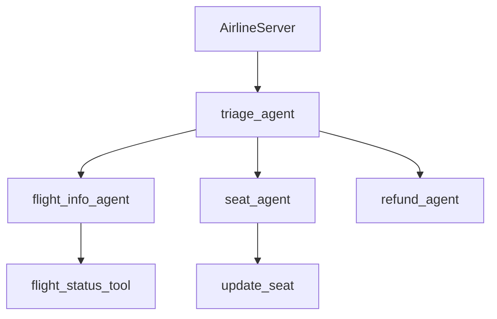

# Wiki Generation V2 — Technical Plan

## Closing the Google Code Wiki Gap

**Date**: 2026-03-01
**Status**: Proposed
**Context**: Deep analysis of [Google Code Wiki](https://codewiki.google/github.com/openai/openai-cs-agents-demo) vs our wiki for the same repo revealed 9 critical gaps. This plan addresses all of them.

---

## The Core Problem

Our current pipeline generates wiki pages like this:

```
For each module in modules:
    Agent 1: Score entities (no LLM)
    Agent 2: Explain top-15 entities (parallel LLM)
    Agent 3: Synthesize module narrative (single LLM)
    → Output: isolated module page
```

Google generates documentation like this:

```
1. Understand the WHOLE codebase
2. Decide sections by FEATURE/CONCERN, not by directory
3. Write ONE coherent narrative with cross-references
4. Annotate every code mention with exact source link
5. Generate diagrams from the actual call/import graph
```

The fundamental difference: **we generate N isolated module summaries. They generate one coherent system document.**

---

## Gap Analysis Summary

| Metric | Google Code Wiki | Our Wiki |
|--------|-----------------|---------|
| **Total content** | 8,292 words / 63,728 chars | ~1,500–2,000 words across 12 pages |
| **Architecture diagrams** | **22 SVG flowcharts** | **0** |
| **Source code links** | **377 GitHub chips** (clickable, exact line) | **0** |
| **Structured tables** | 1 (Agents: Name / Role / Tools) | 0 |
| **Document structure** | 1 coherent doc, 6 H2 + 20 H3 sections | 12 isolated pages |
| **Inline code blocks** | Full TypeScript interfaces, Python classes | 0 |
| **Embedded chat** | Gemini panel in right column | Separate `/chat` route |
| **Cross-section links** | Yes — prose cites other sections as anchors | No |
| **Dark/light toggle** | Yes | Dark only |
| **Zoom-in diagrams** | Yes (per diagram) | N/A |
| **Share button** | Yes | No |
| **Generation date/commit** | Shown at bottom | Not shown |

### 9 Identified Gaps

| # | Gap | Severity |
|---|-----|----------|
| G1 | Single-document strategy (whole-repo narrative) vs isolated module pages | Critical |
| G2 | No architecture diagrams (22 SVGs vs 0) | Critical |
| G3 | No source code links (377 GitHub chips vs 0) | Critical |
| G4 | No agents/components summary tables | High |
| G5 | Content is generic — LLM doesn't see actual code | High |
| G6 | Sections by directory, not by feature/concern | High |
| G7 | No embedded real code blocks | High |
| G8 | Chat panel is separate route, not inline | Medium |
| G9 | No cross-section links in prose | Medium |

---

## New Pipeline: 5 Phases

```
Phase 0: COMPRESS  — Hierarchical code summarization (scales to any repo size)
Phase 1: PLAN      — WikiPlanner decides document structure by feature
Phase 2: NARRATE   — System-level narrative + per-section content generation
Phase 3: ENRICH    — Mechanical post-processing (diagrams, source links, code blocks, tables)
Phase 4: RENDER    — Assemble final pages with all enrichments
```

---

## Phase 0: COMPRESS — The Scaling Strategy

**Problem**: A 50k LOC repo won't fit in any LLM context window. Even our local qwen3-coder-30b at 262k tokens can hold maybe 100k chars of code — that's only ~3000 LOC before exhausting context.

**Solution: Hierarchical summarization pyramid**

```
Level 0 (bottom): Raw files → per-file summaries (1 LLM call per file, ~50 words each)
Level 1:          Per-file summaries grouped by directory → directory summaries
Level 2 (top):    All directory summaries → whole-repo summary
```

**For small repos** (<100 files, <10k LOC): Skip levels. Feed the actual code directly into later phases. The 37-file openai-cs-agents-demo fits entirely in ~60k tokens of code — that's within the 262k window with plenty of room for prompts.

**For medium repos** (100–1000 files): Use Level 0 → Level 2. Each file gets a 50-word summary (1 cheap LLM call). All file summaries (~500 × 50 words = 25k words) fit in one context window for Level 2 synthesis.

**For large repos** (1000+ files): Full 3-level pyramid. Also use the **entity graph from Neo4j** to identify the important 20% of files (high in-degree, high call count) and give them richer summaries while the remaining 80% get minimal summaries.

**Implementation**:

```python
# New file: backend/src/wiki/compressor.py

class CodebaseCompressor:
    """Hierarchical summarization that produces a compressed
    representation of any codebase that fits in a single LLM context."""

    def compress(self, repo_path, entities, fingerprint) -> CompressedCodebase:
        """Returns a CompressedCodebase with:
        - repo_summary: ~500 word whole-repo description
        - file_summaries: dict[filepath, ~50 word summary]
        - directory_summaries: dict[dirpath, ~100 word summary]
        - key_entities: top-50 entities with full signatures + docstrings
        - call_graph_summary: who calls whom (text representation)
        - import_graph_summary: module dependency edges
        """
```

**Why this works for any size**: The pyramid guarantees the output at the top fits in one context window regardless of input size. Each level is embarrassingly parallel (file summaries can all run concurrently). The compression ratio is ~200:1 (a 200-line file → 50 words).

**Token budget at each level:**

| Repo size | Files | Level 0 calls | Level 1 calls | Level 2 calls | Total LLM calls |
|-----------|-------|---------------|---------------|---------------|-----------------|
| Small (37 files) | 37 | 0 (skip, use raw code) | 0 | 0 | 0 |
| Medium (300 files) | 300 | 300 | ~20 | 1 | ~321 |
| Large (3000 files) | 3000 | 3000 | ~100 | 1 | ~3101 |

With parallel execution and qwen3-coder-30b at ~50 tok/s, Level 0 for a 3000-file repo takes ~3000 calls × 0.5s each ÷ 15 parallel = ~100s ≈ 2 minutes. Acceptable.

---

## Phase 1: PLAN — WikiPlanner

**Current state**: We use directory structure to decide modules, then generate one page per module. This produces "Airline", "App", "Lib" — meaningless directory names.

**New approach**: A single LLM call receives the `CompressedCodebase` and decides the document structure **by feature/concern**.

```python
# New file: backend/src/wiki/planner.py

WIKI_PLANNER_PROMPT = """You are a documentation architect. Given a compressed summary
of a codebase, decide the optimal wiki structure.

Codebase summary:
{repo_summary}

Directory summaries:
{directory_summaries}

Key entities (top 50 by importance):
{key_entities}

Call graph summary:
{call_graph}

Output a JSON document structure:
{{
  "title": "repo-name",
  "sections": [
    {{
      "id": "section-slug",
      "title": "Human Title",
      "subsections": [
        {{
          "id": "subsection-slug",
          "title": "Subsection Title",
          "relevant_files": ["file1.py", "file2.ts"],
          "relevant_entities": ["ClassName", "function_name"],
          "describes": "What this subsection should explain"
        }}
      ],
      "diagram_type": "flowchart|sequence|architecture|none",
      "table_type": "components|apis|tools|none"
    }}
  ]
}}

Rules:
- Organize by FEATURE and CONCERN, not by directory
- Each section should explain HOW something works, not just WHAT files exist
- Cross-cutting concerns (auth, error handling, logging) get their own section
- Max 8 top-level sections, max 5 subsections each
- Every file should be covered by at least one subsection
"""
```

**Output**: A `WikiPlan` that replaces the current directory-based module list. Each section knows exactly which files and entities it needs to explain.

**For small repos**: The planner produces 4–6 feature sections. All files are covered.

**For large repos**: The planner produces 6–8 high-level sections with subsections. Files are grouped by feature, not directory. The 80% of files that are utilities/helpers/tests get brief mentions in a "Supporting Infrastructure" section.

---

## Phase 2: NARRATE — Content Generation

This replaces the current Agent 1 → Agent 2 → Agent 3 per-module pipeline with a **plan-aware generation strategy**.

### Step 2a: System Narrative (1 LLM call)

Receives: `CompressedCodebase` + `WikiPlan` + dossier findings
Produces: The opening overview section (equivalent to Google's "Customer Service Agent Demonstration Overview") — a 500–1000 word summary of what the system does, how it's architected, what the key components are, and how they interact. This is the cross-cutting narrative that our current wiki completely lacks.

### Step 2b: Per-Section Content (parallel, 1 LLM call per section)

Each section from the `WikiPlan` gets its own generation call. The prompt includes:

```python
SECTION_WRITER_PROMPT = """Write documentation for this section of a codebase wiki.

SYSTEM CONTEXT (what the whole repo does):
{system_narrative}

THIS SECTION:
Title: {section_title}
Purpose: {section_describes}

OTHER SECTIONS (for cross-referencing):
{other_section_titles_and_ids}

SOURCE CODE (relevant files, full content for small files, summaries for large):
{source_code_or_summaries}

KEY ENTITIES in this section:
{entity_details_with_signatures}

DOSSIER FINDINGS relevant to this section:
{dossier_context}

Rules:
- Write 500-1500 words of prose explaining HOW this part of the system works
- Reference specific class names, function names, and file paths using [[entity:QualifiedName]] markers
- Reference other sections using [[section:section-slug]] markers
- If you identify a key interface/type/config, mark it with [[code:filepath:start:end]] for inline embedding
- If this section has agents/services/components, include a structured table
- Be specific: name actual classes, methods, parameters. No generic descriptions.
- Return JSON with: prose, entities_referenced[], sections_referenced[], code_blocks[], tables[]
"""
```

**Critical detail: the `{source_code_or_summaries}` context budget.**

For each section, the planner identified `relevant_files`. The content generator:
1. For files < 200 lines: include full file content
2. For files 200–1000 lines: include the important entities (top-scored) with full bodies + file summary
3. For files > 1000 lines: include only the entity signatures + docstrings + the file summary from Phase 0

This is the key difference from our current pipeline which only feeds entity metadata. The LLM needs to **read actual code** to write specific documentation.

**Token budget per section**: ~50k tokens of context (code + entities + system narrative + dossier) → ~2000 tokens output. With 6–8 sections running in parallel, this takes ~60s on qwen3-coder-30b.

---

## Phase 3: ENRICH — Mechanical Post-Processing

This phase requires **zero LLM calls**. It's pure deterministic code that transforms the raw prose into rich wiki content.

### 3a: Source Link Injection

The LLM wrote markers like `[[entity:AirlineServer]]`. The enricher:

```python
def inject_source_links(prose: str, entity_index: dict, repo_url: str, commit: str) -> str:
    """Replace [[entity:X]] markers with GitHub links.

    entity_index maps qualified_name → {file_path, line_start}
    Output: <a href="github.com/owner/repo/blob/commit/file#L42">AirlineServer</a>
    """
```

We already have `file_path` and `line_start` for every entity in PostgreSQL. This is a string replacement pass.

### 3b: Code Block Embedding

Markers like `[[code:python-backend/server.py:42:68]]` get replaced with the actual source code from the cloned repo:

```python
def inject_code_blocks(prose: str, repo_path: str) -> str:
    """Replace [[code:file:start:end]] markers with actual source code."""
```

### 3c: Mermaid Diagram Generation

For each section where `diagram_type != "none"`, generate a Mermaid diagram from the **entity graph** (Neo4j call graph + import graph):

```python
def generate_section_diagram(
    section: WikiSection,
    entities: list[ParsedEntity],
    call_graph: dict,
    diagram_type: str,  # flowchart, sequence, architecture
) -> str:
    """Generate Mermaid syntax from the actual code entity graph.

    For 'architecture': Show major components and their connections
    For 'flowchart': Show data/control flow through the section's entities
    For 'sequence': Show request/response flow between components
    """
```

This is **NOT** an LLM call. We traverse the Neo4j graph for the section's entities and mechanically produce Mermaid syntax:



The diagram is then rendered to SVG either:
- Server-side using `mermaid-cli` (Node.js, `mmdc` command)
- Client-side using `mermaid.js` in the frontend (lighter, no server dependency)

**For large repos**: Diagrams are scoped to each section's entities (not the whole repo). A section with 30 entities produces a readable diagram. The whole-repo architecture diagram uses only the top-level modules/packages.

### 3d: Table Generation

For sections where the planner flagged `table_type`, extract structured data from entities:

```python
def generate_component_table(entities: list, section: WikiSection) -> dict:
    """Build structured table from entities.

    Returns: {headers: [...], rows: [[...]]}
    """
    # e.g., for agents: Name | Role (from docstring) | Key Methods
    # e.g., for APIs: Endpoint | Method | Handler | Description
```

### 3e: Cross-Section Link Resolution

Replace `[[section:backend-orchestration]]` markers with actual anchor links.

---

## Phase 4: RENDER — Final Assembly

Assembles the enriched sections into the final wiki page structure that the frontend renders.

**Critical decision: Single page vs multi-page?**

Google uses a single page. For small/medium repos this is better — the developer gets one coherent document. For very large repos, a single page would be 50k+ words and unwieldy.

**Approach: Adaptive rendering**

```python
def assemble_wiki(plan: WikiPlan, sections: list[EnrichedSection]) -> list[WikiPage]:
    """
    Small repos (<8 sections, <10k words total):
        → 1 page: system overview + all sections inline

    Medium repos (8-15 sections, 10k-30k words):
        → Home page (overview + section summaries)
        → 1 page per top-level section (subsections inline)

    Large repos (15+ sections, 30k+ words):
        → Home page (overview + section summaries)
        → 1 page per top-level section
        → Deep-dive subpages for complex subsections
    """
```

The frontend `WikiReader.tsx` already supports sidebar navigation with sections. For the single-page case, all sections go into one page's content with anchor IDs. The sidebar TOC becomes intra-page anchors (exactly like Google Code Wiki).

---

## Integration with Existing Pipeline

The new phases slot into the existing `analyze.py` flow:

```
Current flow:
  Step 1: Clone
  Step 2: RepoRecon (fingerprint)
  Step 3: Parse entities
  Step 4: Detect modules → persist entities + modules
  Step 5: Neo4j graph
  Step 6: Qdrant index
  Step 7: Facet agents (dossier)
  Step 8: Generate wiki pages  ← THIS CHANGES
  Step 9: Done

New Step 8:
  Step 8a: Phase 0 — Compress (hierarchical summaries)
  Step 8b: Phase 1 — Plan (WikiPlanner decides structure)
  Step 8c: Phase 2 — Narrate (system overview + per-section content)
  Step 8d: Phase 3 — Enrich (links, diagrams, code blocks, tables)
  Step 8e: Phase 4 — Render (assemble final pages)
```

**What we keep**: All of steps 1–7 remain unchanged. RepoRecon, entity parsing, Neo4j graph, Qdrant indexing, and the full dossier agent pipeline all stay. They feed into the new wiki generation pipeline.

**What we replace**: The current `generate_module_wiki()` per-module loop in `_generate_all_pages()`. The Agent 1/2/3 per-module pipeline becomes Phase 2's per-section generation. The key difference is the sections are feature-based (from Phase 1 planner), not directory-based.

**What we add**:
- `backend/src/wiki/compressor.py` — Phase 0
- `backend/src/wiki/planner.py` — Phase 1
- `backend/src/wiki/enricher.py` — Phase 3 (source links, code blocks, diagrams, tables)
- Modifications to `backend/src/wiki/orchestrator.py` — Phase 2 + Phase 4

---

## LLM Call Budget (Total)

| Phase | Calls (37-file repo) | Calls (300-file repo) | Calls (3000-file repo) |
|-------|---------------------|----------------------|----------------------|
| Phase 0: Compress | 0 (skip) | ~321 | ~3101 |
| Phase 1: Plan | 1 | 1 | 1 |
| Phase 2a: System narrative | 1 | 1 | 1 |
| Phase 2b: Section content | 6 (parallel) | 8 (parallel) | 10 (parallel) |
| Phase 3: Enrich | 0 (deterministic) | 0 | 0 |
| **Total** | **~8** | **~331** | **~3113** |

Compare to current pipeline: 7 modules × (15 entity calls + 1 synthesis) = **112 LLM calls** for the 37-file repo. The new pipeline uses **~8 calls** for the same repo — significantly fewer, and they produce better content because each call sees the whole-system context.

For large repos, Phase 0 dominates at ~3000 calls, but these are trivially small calls (single file in, 50 words out) that run in massive parallel.

---

## Frontend Changes Needed

1. **Mermaid rendering**: Add `mermaid.js` to the frontend. When page content contains ` ```mermaid ` blocks, render them as interactive SVGs with zoom.

2. **Source link chips**: When content contains `<a class="source-link" href="...">EntityName</a>`, render them as styled chips (background pill, monospace font) that open GitHub in a new tab.

3. **Inline code blocks**: Content already supports markdown code blocks. Just need syntax highlighting (already have `CodeBlock.tsx`).

4. **Tables**: Content contains `{headers, rows}` objects. Render as styled tables.

5. **Single-page TOC**: For small repos, the sidebar becomes intra-page anchor navigation (scroll-spy), not page navigation. WikiReader already has scroll-spy logic.

6. **Chat panel**: Move from separate `/chat` route to a collapsible right column in `WikiReader.tsx`. Reuse existing chat API.

---

## Implementation Order

```
Iteration 1 (Highest impact, medium effort):
  - Phase 3a: Source link injection (enricher.py)
  - Phase 3c: Mermaid diagram generation from Neo4j graph
  - Frontend: Mermaid.js + source link chip rendering
  → These are mechanical changes that immediately improve existing content

Iteration 2 (Transformative, high effort):
  - Phase 0: Compressor
  - Phase 1: WikiPlanner
  - Phase 2: Rewrite orchestrator with plan-aware section generation
  → This changes the content from directory docs to system docs

Iteration 3 (Polish):
  - Phase 3b: Code block embedding
  - Phase 3d: Component tables
  - Phase 3e: Cross-section links
  - Frontend: Inline chat panel
  - Frontend: Single-page vs multi-page adaptive rendering
```

---

## Files to Create/Modify

| File | Action | Purpose |
|------|--------|---------|
| `backend/src/wiki/compressor.py` | **Create** | Phase 0: Hierarchical code summarization |
| `backend/src/wiki/planner.py` | **Create** | Phase 1: Feature-based document structure planning |
| `backend/src/wiki/enricher.py` | **Create** | Phase 3: Source links, code blocks, diagrams, tables |
| `backend/src/wiki/orchestrator.py` | **Modify** | Phase 2 + 4: Plan-aware narration and assembly |
| `backend/src/wiki/context_builder.py` | **Modify** | Feed actual code content, not just entity metadata |
| `backend/src/jobs/analyze.py` | **Modify** | Wire new 5-phase pipeline into step 8 |
| `frontend/src/app/[owner]/[name]/WikiReader.tsx` | **Modify** | Mermaid, source chips, tables, single-page TOC, chat panel |
| `frontend/package.json` | **Modify** | Add mermaid.js dependency |

---

## Key Insight

The gap isn't about missing features — it's about generation strategy. Google feeds the LLM the whole codebase and asks "explain this system." We feed the LLM one module at a time and ask "describe this directory." The 5-phase pipeline fixes that by compressing first, planning second, and then generating content with whole-system awareness.
