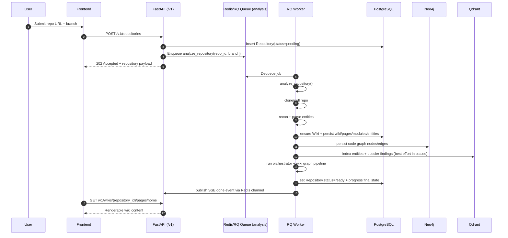
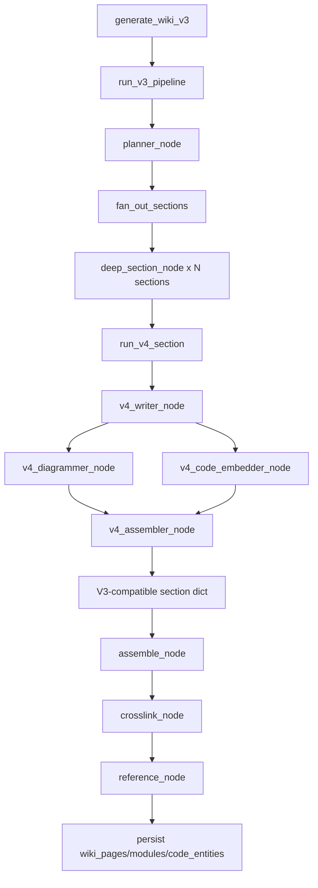

# Repository Submission → Consumable Wiki Pipeline

This document traces the runtime path from repository submission to a wiki that the frontend can read.

## Scope

- Start: user submits a repository URL from the UI.
- End: `Repository.status = ready`, wiki pages persisted, and `/v1/wikis/*` endpoints serve content.

## End-to-End Flow (High Level)



## Complete Runtime Sequence (Step-by-Step, Including Embeddings)

### 0) Frontend submit interaction

1. User enters repo URL/branch on submit page.
2. UI validates URL pattern locally.
3. UI calls `POST /v1/repositories`.
4. UI navigates to progress page with `?id=<repo_id>`.

Primary source:
- `frontend/src/app/submit/page.tsx`
- `frontend/src/services/api.ts` (`repositories.create`)

### 1) Backend intake + queueing

1. API validates URL and checks whether repo already exists.
2. API creates `repositories` row with `status=pending`.
3. API enqueues RQ job `src.jobs.analyze.analyze_repository(repo.id, branch)` on queue `analysis`.
4. API returns `202`.

Primary source:
- `backend/src/api/routes/repositories.py#create_repository`
- `backend/src/api/deps.py#get_job_queue`

### 2) Worker bootstrap and progress channeling

1. Worker dequeues and enters `analyze_repository`.
2. Repository status flips to `analyzing`.
3. `_emit_progress` writes structured progress JSON to PostgreSQL.
4. Same progress payload is also published to Redis pub/sub for SSE.

Primary source:
- `backend/src/jobs/analyze.py` (`analyze_repository`, `_emit_progress`)
- `backend/src/api/progress_events.py`

### 3) Pipeline Step 1: clone/pull + commit

1. Clone repo into cache (or pull if cached).
2. Resolve commit hash from local checkout.
3. Publish progress detail with commit short SHA.

Primary source:
- `backend/src/jobs/analyze.py` (Step 1)
- `backend/src/storage/repo_cache.py`

### 4) Pipeline Step 2: reconnaissance

1. Run `repo_recon.run()` on local path.
2. Collect file count, LOC, language ranking.
3. Detect source roots and build-output directories.
4. Feed `build_output_dirs` into parse stage.

Primary source:
- `backend/src/jobs/analyze.py` (Step 2)
- `backend/src/recon/repo_recon.py`

### 5) Pipeline Step 3: parse source entities

1. `extract_entities()` walks the repository with skip filters.
2. For supported files, language parser returns `ParsedEntity` records (`name`, `qualified_name`, `type`, spans, `calls`, `imports`, metadata).
3. Build artifacts/minified bundles and unsupported files are excluded.

Primary source:
- `backend/src/jobs/analyze.py` (Step 3)
- `backend/src/parsers/extractor.py`
- `backend/src/parsers/base.py`

### 6) Pipeline Step 4: persist entities + vector embeddings (Qdrant `code_entities`)

1. Ensure `wikis` row exists for repository.
2. Decide whether to run vector indexing:
   - if embedding endpoint equals LLM endpoint, skip indexing (to avoid model eviction);
   - otherwise run indexing.
3. `index_entities()` builds embedding text per entity (entity type + qualified name + doc/signature/name).
4. `embed_batch()` generates vectors from LM Studio/OpenAI-compatible embedding endpoint.
5. `upsert()` writes points into Qdrant collection `code_entities` with payload (`repo_id`, `qualified_name`, `entity_type`, file/line info).
6. Vector indexing failures are non-fatal; pipeline continues.

Primary source:
- `backend/src/jobs/analyze.py` (Step 4)
- `backend/src/dossier/rag_index.py#index_entities`
- `backend/src/llm/embeddings.py`
- `backend/src/storage/vector_db.py`

### 7) Pipeline Step 4b: persist graph nodes/edges (Neo4j)

1. Create Neo4j node per parsed entity.
2. Build `name -> qualified_name` lookup for fuzzy call-target resolution.
3. For each parsed `entity.calls` item:
   - exact qname match first;
   - short-name fallback via lookup;
   - unresolved targets are counted and skipped.
4. Persist `CALLS` relationships.

Primary source:
- `backend/src/jobs/analyze.py#_write_neo4j`
- `backend/src/storage/graph_db.py`

### 8) Pipeline Step 5: compress codebase

1. Initialize index cache (best effort).
2. Score entity interestingness.
3. Generate compressed summaries (`CompressedCodebase`) for repo/files/directories/call-import summaries.
4. Continue even if compression fails (best effort).

Primary source:
- `backend/src/jobs/analyze.py` (Step 5)
- `backend/src/wiki/compressor.py`
- `backend/src/wiki/interestingness.py`

### 9) Pipeline Step 6: facet analysis orchestrator + dossier embeddings

1. Run orchestrator tiers: heuristic (parallel) -> react (sequential) -> single-pass (parallel).
2. Run synthesis agent for conflict consolidation.
3. Serialize dossier artifact to disk.
4. Index dossier findings into Qdrant `dossier_findings`:
   - `_build_records()` transforms responses into text+payload;
   - `embed_batch()` creates vectors;
   - `upsert()` stores vectors with `repository_id` payload filter.
5. Dossier indexing is best effort at orchestrator layer (failure logged, pipeline continues).

Primary source:
- `backend/src/jobs/analyze.py` (Step 6)
- `backend/src/orchestrator/graph.py` (`AnalysisPipeline.run`, `index_dossier` callsite)
- `backend/src/dossier/rag_index.py#index_dossier`
- `backend/src/llm/embeddings.py`
- `backend/src/storage/vector_db.py`

### 10) Pipeline Step 8: wiki generation (V3 graph + V4 section pipeline)

1. `generate_wiki_v3()` builds initial graph state (repo info, fingerprint, dossier dict, compressed dict, all files).
2. `run_v3_pipeline()` executes graph:
   - `planner_node`
   - `fan_out_sections`
   - `deep_section_node` per section (bounded concurrency)
   - `assemble_node`
   - `crosslink_node`
   - `reference_node`
3. Each deep section executes V4 subgraph:
   - writer (prose + `<diagram/>` + `<code/>` placeholders)
   - diagrammer (mermaid generation)
   - code embedder (validated file/symbol/line extraction)
   - assembler (placeholder substitution -> typed `prose_segments`)
4. Persist results:
   - recreate `wiki_pages` and `modules` for this run
   - persist module-linked `code_entities` rows
   - write planner-driven home-page `section_summaries`/reading order metadata
   - validate required reference pages.

Primary source:
- `backend/src/jobs/analyze.py` (Step 8)
- `backend/src/wiki/wiki_pipeline.py`
- `backend/src/wiki/wiki_graph.py`
- `backend/src/wiki/section_graph.py`
- `backend/src/wiki/agents/v4_writer.py`
- `backend/src/wiki/agents/v4_diagrammer.py`
- `backend/src/wiki/agents/v4_code_embedder.py`
- `backend/src/wiki/agents/v4_assembler.py`
- `backend/src/wiki/agents/v4_placeholder_parser.py`

### 11) Pipeline Step 9: finalize state + terminal event

1. Set repository status `ready` (or `error` in exception path).
2. Persist final metadata (`last_analyzed_commit`, `last_analyzed_at`, languages, size stats).
3. Attach warning/degraded metadata when generation warnings exist.
4. Publish terminal SSE done event.

Primary source:
- `backend/src/jobs/analyze.py` (Step 9 + exception handling)
- `backend/src/models/repository.py`

### 12) Consumption path (frontend + API)

1. Progress UI subscribes to `/v1/repositories/{id}/progress/stream` until terminal event.
2. Wiki reader resolves repo by owner/name, then fetches:
   - `/v1/wikis/{repository_id}/modules`
   - `/v1/wikis/{repository_id}/pages/home`
   - `/v1/wikis/{repository_id}/pages/{slug}`
3. Render persisted wiki content to end user.

Primary source:
- `frontend/src/app/[owner]/[name]/progress/page.tsx`
- `frontend/src/app/[owner]/[name]/WikiReader.tsx`
- `frontend/src/services/api.ts`
- `backend/src/api/routes/repositories.py#stream_progress`
- `backend/src/api/routes/wikis.py`

## V3 + V4 Wiki Generation Internals



## Source Mapping Matrix

| Runtime phase | Source entrypoints | Key outputs |
|---|---|---|
| UI submission | `frontend/src/app/submit/page.tsx` | Repository URL + branch posted |
| API intake | `backend/src/api/routes/repositories.py#create_repository` | `Repository` row + RQ job |
| Queue binding | `backend/src/api/deps.py#get_job_queue` | Queue `"analysis"` |
| Job execution | `backend/src/jobs/analyze.py#analyze_repository` | Full pipeline orchestration |
| Repo cache ops | `backend/src/storage/repo_cache.py` | Local checkout + commit SHA |
| Recon | `backend/src/recon/repo_recon.py#run` | `RepoFingerprint` |
| Parser | `backend/src/parsers/extractor.py#extract_entities` | `ParsedEntity[]` |
| Entity vector index | `backend/src/dossier/rag_index.py#index_entities` | Qdrant `code_entities` vectors |
| Graph persistence | `backend/src/jobs/analyze.py#_write_neo4j`, `backend/src/storage/graph_db.py` | Neo4j nodes/edges |
| Compression | `backend/src/wiki/compressor.py` | `CompressedCodebase` |
| Facet analysis | `backend/src/orchestrator/graph.py#run_analysis` | Dossier responses |
| Dossier RAG | `backend/src/dossier/rag_index.py#index_dossier` | Qdrant `dossier_findings` |
| Wiki graph | `backend/src/wiki/wiki_graph.py` | Planned + generated sections |
| Section subgraph | `backend/src/wiki/section_graph.py` + `wiki/agents/v4_*` | Final `prose_segments` per section |
| Persistence | `backend/src/wiki/wiki_pipeline.py#generate_wiki_v3` | `wiki_pages`, `modules`, `code_entities` |
| Progress streaming | `backend/src/api/progress_events.py`, `repositories.py#stream_progress` | SSE events to frontend |
| Consumption APIs | `backend/src/api/routes/wikis.py` | Page/module/entity payloads |
| Reader UI | `frontend/src/app/[owner]/[name]/WikiReader.tsx` | User-consumable wiki experience |

## Data/Storage Mapping

```mermaid
flowchart LR
    A[Parsed entities] --> B[(PostgreSQL)]
    A --> C[(Neo4j)]
    A --> D[(Qdrant code_entities)]
    E[Dossier findings] --> F[(Qdrant dossier_findings)]
    G[Generated wiki sections/pages] --> B
    H[Repository progress + status] --> B
    H --> I[(Redis pub/sub)]
    I --> J[SSE /v1/repositories/{id}/progress/stream]
    J --> K[Frontend Progress + Wiki Reader]
```

## Notes

- Backend progress step numbers are intentionally non-contiguous (`1,2,3,4,5,6,8,9`); step 7 is not used in current flow.
- UI remaps backend steps for display (`frontend/src/app/[owner]/[name]/progress/page.tsx`, `mapBackendStepToUiIndex`).
- Consumable-ready condition is effectively:
  - `repositories.status = ready`
  - wiki pages/modules persisted
  - `/v1/wikis/{repository_id}` and `/v1/wikis/{repository_id}/pages/*` return content.
